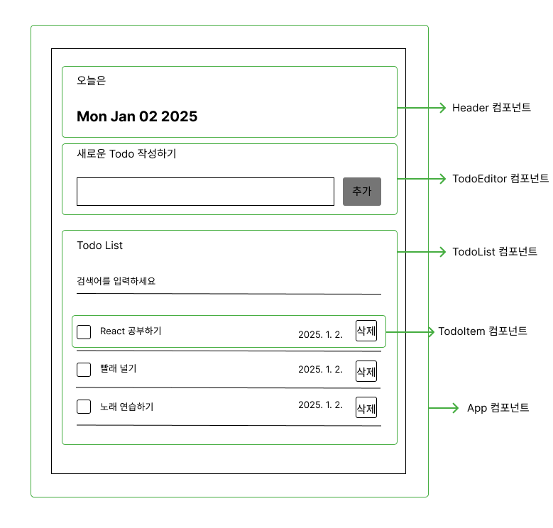

### 기능 구현 준비 - 컴포넌트별로 기능 정리 
- App 컴포넌트 : 할 일 데이터 관리하기
- Header 컴포넌트 : 오늘의 날짜 표시
- TodoEditor 컴포넌트 : 새로운  할 일 아이템 생성
- TodoList 컴포넌트 : 검색에 따라 필터링된 할 일 아이템 렌더링
- TodoItem 컴포넌트 : 할 일 아이템 수정 및 삭제
---
- C : 할 일 아이템 생성
- R : 할 일 아이템 렌더링
- U : 할 일 아이템 수집
- D : 할 일 아이템 삭제
